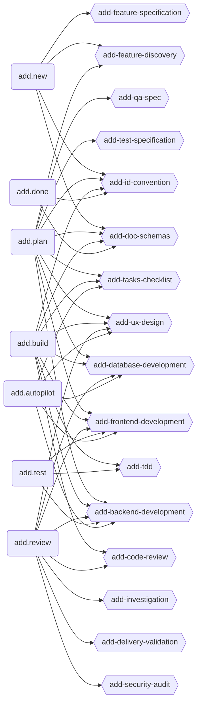
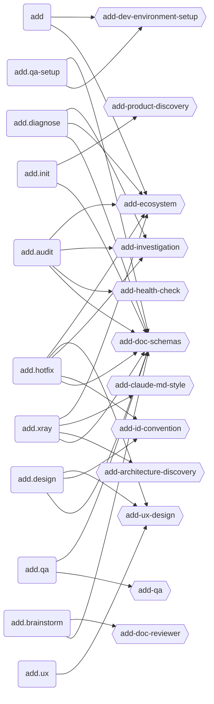
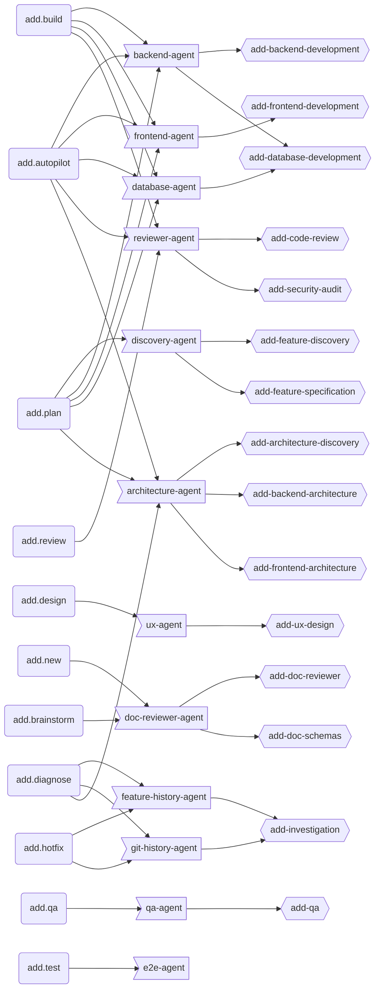
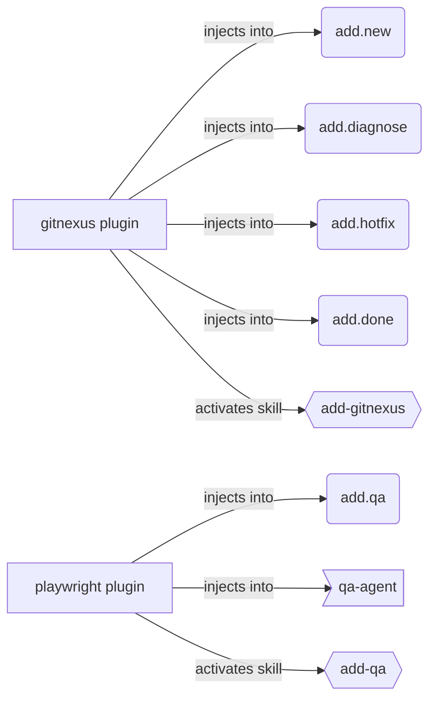

# ADD Ecosystem Map

> Integration map of all commands, skills, and agents in the ADD framework. For gap analysis and orphaned artefacts see [0022-PLAN](docs/plans/0022-PLAN--ecosystem-master-map.md).

Four graphs: **Core Pipeline** (main development flow), **Support Commands** (auxiliary flow), **Agent Dispatch** (subagent orchestration), **Plugin Integrations** (optional MCP plugins).

Node shapes: `(command)` rounded · `{{skill}}` hexagon · `>agent]` flag · `[plugin]` square

---

## Graph 1 — Core Pipeline

Commands in the main feature development flow and the skills they load.

---

## Graph 2 — Support Commands

Auxiliary commands (gateway, discovery, emergency, analysis, QA) and their skills.

---

## Graph 3 — Agent Dispatch

Which commands dispatch which agents, and which skills each agent loads.

---

## Graph 4 — Plugin Integrations

Optional MCP plugins that inject additive guidance into commands and agents. Disabled by default — enable via `codeadd plugins enable <name>`.

---

> Auto-generated by `add.sync` — do not edit manually.
> Source of truth for AI agents: `framwork/.codeadd/skills/add-ecosystem/SKILL.md`
