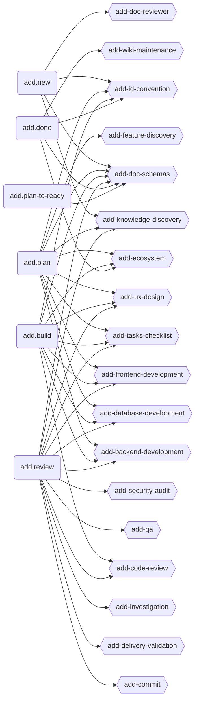
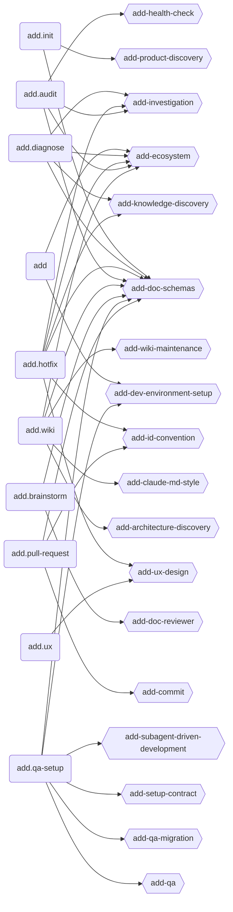
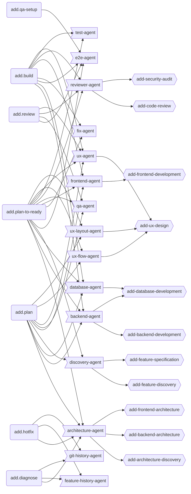

<!-- AUTO-GENERATED by /add-framework--sync. DO NOT EDIT MANUALLY. -->
# ADD Ecosystem Map

> Integration map generated from the current command, skill, and agent sources.

## Graph 1 - Core Pipeline

## Graph 2 - Support Commands

## Graph 3 - Agent Dispatch

> Source of truth for AI agents: `framwork/.codeadd/skills/add-ecosystem/SKILL.md`
