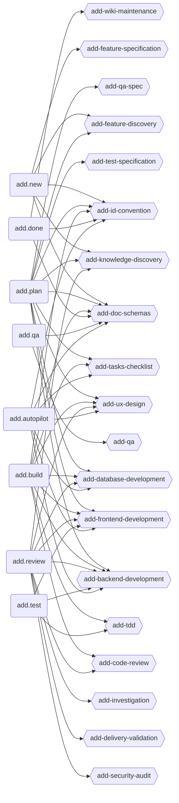
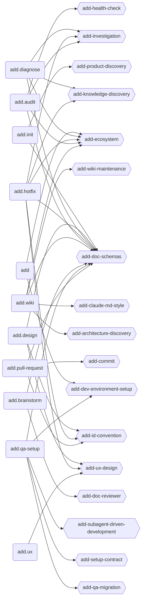
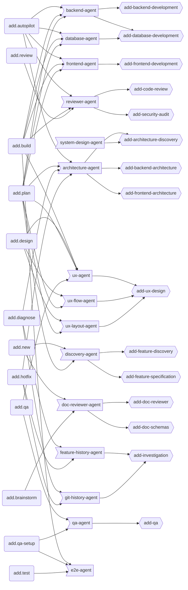
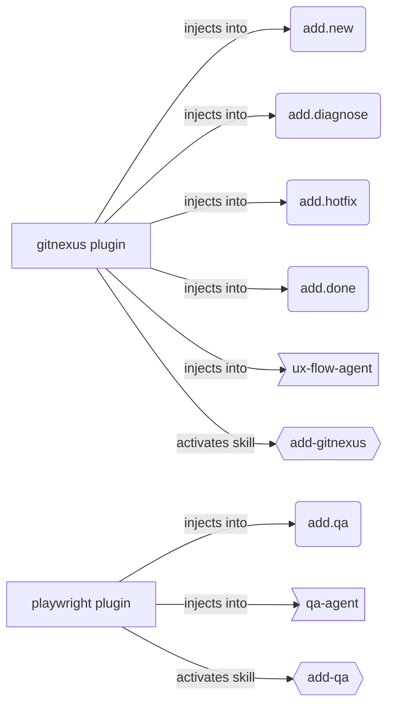

# ADD Ecosystem Map

> Integration map of all commands, skills, and agents in the ADD framework. For gap analysis and orphaned artefacts see [0022-PLAN](docs/plans/0022-PLAN--ecosystem-master-map.md).

Four graphs: **Core Pipeline** (main development flow), **Support Commands** (auxiliary flow), **Agent Dispatch** (subagent orchestration), **Plugin Integrations** (optional MCP plugins).

**19 commands · 40 skills · 15 agents · 5 providers** (claude, codex, cursor, antigrav, opencode)

Node shapes: `(command)` rounded · `{{skill}}` hexagon · `>agent]` flag · `[plugin]` square

---

## Graph 1 — Core Pipeline

Commands in the main feature development flow and the skills they load.

> `add-tdd` / `add-test-specification` load only with the `tdd` feature enabled; `add-qa-spec` only with `qa-pipeline` enabled.

---

## Graph 2 — Support Commands

Auxiliary commands (gateway, discovery, emergency, analysis, QA bootstrap) and their skills.

---

## Graph 3 — Agent Dispatch

Which commands dispatch which agents, and which skills each agent loads.

> **UX pipeline.** `add.plan` STEP 8.1 runs `@ux-flow-agent → @ux-layout-agent → @ux-agent` (critique) automatically for any UI-touching feature and consolidates `design.md` itself. `/add.design` is the manual entry point to that same pipeline, not a required prior step.
>
> **QA dual judge.** `/add.qa` dispatches `@ux-agent` (review mode — judgement axes) in parallel with `@qa-agent` (deterministic axes, functional delivery, a11y, failure forensics), then merges their findings.

---

## Graph 4 — Plugin Integrations

Optional MCP plugins that inject additive guidance into commands and agents. Disabled by default — enable via `codeadd plugins enable <name>`.

---

## Features

| Feature | Default | Injects into | Purpose |
|---------|---------|--------------|---------|
| `tdd` | enabled | add.plan, add.build, add.review | RED-GREEN-REFACTOR discipline + contract-test specs |
| `qa-pipeline` | disabled | add.plan, add.test, add.build | E2E spec authoring + agent QA validation |

Enable/disable via `codeadd features enable|disable|list <name>`.

---

> Auto-generated by `/add-framework--sync` — do not edit manually.
> Source of truth for AI agents: `framwork/.codeadd/skills/add-ecosystem/SKILL.md`
