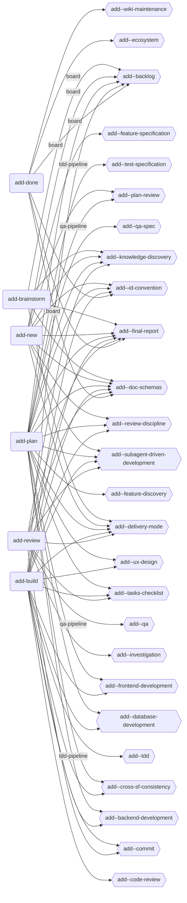
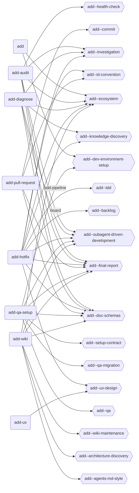
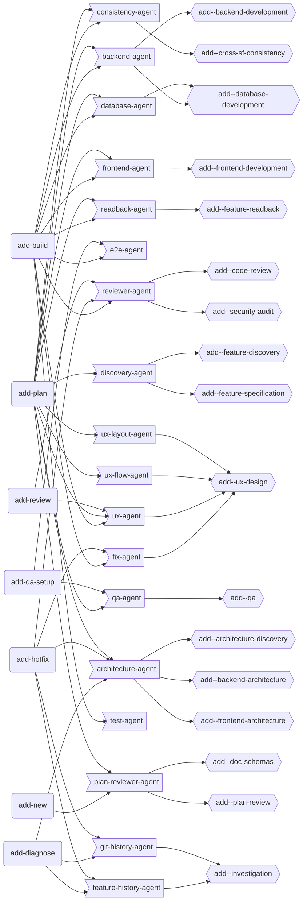

<!-- AUTO-GENERATED by /add-framework--sync. DO NOT EDIT MANUALLY. -->
# ADD Ecosystem Map

> Integration map generated from the current command, skill, and agent sources.
> An edge `command --> skill` means the command loads that skill. A labelled edge means the
> skill arrives through an **optional feature** fragment and is absent unless it is enabled.

## Graph 1 - Core Pipeline

```mermaid
graph LR
  BRAINSTORM(add-brainstorm)
  NEW(add-new)
  PLAN(add-plan)
  BUILD(add-build)
  REVIEW(add-review)
  DONE(add-done)

  BADE{{add--backend-development}}
  BA{{add--backlog}}
  CORE{{add--code-review}}
  CO{{add--commit}}
  CRSFCO{{add--cross-sf-consistency}}
  DADE{{add--database-development}}
  DEMO{{add--delivery-mode}}
  DOSC{{add--doc-schemas}}
  EC{{add--ecosystem}}
  FEDI{{add--feature-discovery}}
  FESP{{add--feature-specification}}
  FIRE{{add--final-report}}
  FRDE{{add--frontend-development}}
  IDCO{{add--id-convention}}
  IN{{add--investigation}}
  KNDI{{add--knowledge-discovery}}
  PLRE{{add--plan-review}}
  QA{{add--qa}}
  QASP{{add--qa-spec}}
  REDI{{add--review-discipline}}
  SUDRDE{{add--subagent-driven-development}}
  TACH{{add--tasks-checklist}}
  TD{{add--tdd}}
  TESP{{add--test-specification}}
  UXDE{{add--ux-design}}
  WIMA{{add--wiki-maintenance}}

  BRAINSTORM --> DEMO & DOSC & FIRE & KNDI
  BRAINSTORM -->|board| BA
  NEW --> DEMO & DOSC & FESP & FIRE & IDCO & KNDI & PLRE & REDI & SUDRDE
  NEW -->|board| BA
  PLAN --> BADE & CRSFCO & DADE & DEMO & DOSC & FEDI & FIRE & FRDE & IDCO & KNDI & PLRE & REDI & SUDRDE & TACH & UXDE
  PLAN -->|board| BA
  PLAN -->|qa-pipeline| QASP
  PLAN -->|tdd-pipeline| TESP
  BUILD --> BADE & CORE & CO & CRSFCO & DADE & DEMO & DOSC & FIRE & FRDE & IDCO & REDI & SUDRDE & TACH & UXDE
  BUILD -->|board| BA
  BUILD -->|tdd-pipeline| TD
  REVIEW --> CO & DEMO & DOSC & FIRE & IN & KNDI & SUDRDE & TACH
  REVIEW -->|qa-pipeline| QA
  DONE --> DOSC & EC & FIRE & IDCO & WIMA
  DONE -->|board| BA
```

## Graph 2 - Support Commands

```mermaid
graph LR
  ADD(add)
  AUDIT(add-audit)
  DIAGNOSE(add-diagnose)
  HOTFIX(add-hotfix)
  PULLREQUEST(add-pull-request)
  QASETUP(add-qa-setup)
  UX(add-ux)
  WIKI(add-wiki)

  AGMDST{{add--agents-md-style}}
  ARDI{{add--architecture-discovery}}
  BA{{add--backlog}}
  CO{{add--commit}}
  DEENSE{{add--dev-environment-setup}}
  DOSC{{add--doc-schemas}}
  EC{{add--ecosystem}}
  FIRE{{add--final-report}}
  HECH{{add--health-check}}
  IDCO{{add--id-convention}}
  IN{{add--investigation}}
  KNDI{{add--knowledge-discovery}}
  QA{{add--qa}}
  QAMI{{add--qa-migration}}
  SECO{{add--setup-contract}}
  SUDRDE{{add--subagent-driven-development}}
  TD{{add--tdd}}
  UXDE{{add--ux-design}}
  WIMA{{add--wiki-maintenance}}

  ADD --> DEENSE & EC
  AUDIT --> DOSC & EC & FIRE & HECH & IN & SUDRDE
  DIAGNOSE --> DOSC & EC & FIRE & IN & KNDI & SUDRDE
  HOTFIX --> DOSC & EC & FIRE & IDCO & IN & KNDI & SUDRDE & UXDE
  HOTFIX -->|board| BA
  HOTFIX -->|tdd-pipeline| TD
  PULLREQUEST --> CO & DOSC & FIRE & IDCO
  QASETUP --> DEENSE & DOSC & FIRE & QA & QAMI & SECO & SUDRDE
  UX --> UXDE
  WIKI --> AGMDST & ARDI & DOSC & EC & FIRE & SUDRDE & WIMA
```

## Graph 3 - Agent Dispatch

```mermaid
graph LR
  BUILD(add-build)
  DIAGNOSE(add-diagnose)
  HOTFIX(add-hotfix)
  NEW(add-new)
  PLAN(add-plan)
  QASETUP(add-qa-setup)
  REVIEW(add-review)

  ARCHITECTURE>architecture-agent]
  BACKEND>backend-agent]
  CONSISTENCY>consistency-agent]
  DATABASE>database-agent]
  DISCOVERY>discovery-agent]
  E2E>e2e-agent]
  FEATUREHISTORY>feature-history-agent]
  FIX>fix-agent]
  FRONTEND>frontend-agent]
  GITHISTORY>git-history-agent]
  PLANREVIEWER>plan-reviewer-agent]
  QAA>qa-agent]
  READBACK>readback-agent]
  REVIEWER>reviewer-agent]
  TEST>test-agent]
  UX>ux-agent]
  UXFLOW>ux-flow-agent]
  UXLAYOUT>ux-layout-agent]

  ARCHITECTUREDISCOVERY{{add--architecture-discovery}}
  BACKENDARCHITECTURE{{add--backend-architecture}}
  BACKENDDEVELOPMENT{{add--backend-development}}
  CODEREVIEW{{add--code-review}}
  CROSSSFCONSISTENCY{{add--cross-sf-consistency}}
  DATABASEDEVELOPMENT{{add--database-development}}
  DOCSCHEMAS{{add--doc-schemas}}
  FEATUREDISCOVERY{{add--feature-discovery}}
  FEATUREREADBACK{{add--feature-readback}}
  FEATURESPECIFICATION{{add--feature-specification}}
  FRONTENDARCHITECTURE{{add--frontend-architecture}}
  FRONTENDDEVELOPMENT{{add--frontend-development}}
  INVESTIGATION{{add--investigation}}
  PLANREVIEW{{add--plan-review}}
  QAS{{add--qa}}
  SECURITYAUDIT{{add--security-audit}}
  UXDESIGN{{add--ux-design}}

  BUILD --> BACKEND & CONSISTENCY & DATABASE & E2E & FIX & FRONTEND & READBACK & REVIEWER & TEST & UX
  DIAGNOSE --> ARCHITECTURE & FEATUREHISTORY & GITHISTORY
  HOTFIX --> ARCHITECTURE & FEATUREHISTORY & FIX & GITHISTORY & REVIEWER
  NEW --> PLANREVIEWER
  PLAN --> ARCHITECTURE & BACKEND & CONSISTENCY & DATABASE & DISCOVERY & FRONTEND & PLANREVIEWER & QAA & READBACK & UX & UXFLOW & UXLAYOUT
  QASETUP --> E2E & QAA
  REVIEW --> REVIEWER & UX

  ARCHITECTURE --> ARCHITECTUREDISCOVERY & BACKENDARCHITECTURE & FRONTENDARCHITECTURE
  BACKEND --> BACKENDDEVELOPMENT & DATABASEDEVELOPMENT
  CONSISTENCY --> CROSSSFCONSISTENCY
  DATABASE --> DATABASEDEVELOPMENT
  DISCOVERY --> FEATUREDISCOVERY & FEATURESPECIFICATION
  FEATUREHISTORY --> INVESTIGATION
  FIX --> UXDESIGN
  FRONTEND --> FRONTENDDEVELOPMENT
  GITHISTORY --> INVESTIGATION
  PLANREVIEWER --> DOCSCHEMAS & PLANREVIEW
  QAA --> QAS
  READBACK --> FEATUREREADBACK
  REVIEWER --> CODEREVIEW & SECURITYAUDIT
  UX --> UXDESIGN
  UXFLOW --> UXDESIGN
  UXLAYOUT --> UXDESIGN
```

> Source of truth for AI agents: `framwork/.codeadd/skills/add--ecosystem/SKILL.md`
